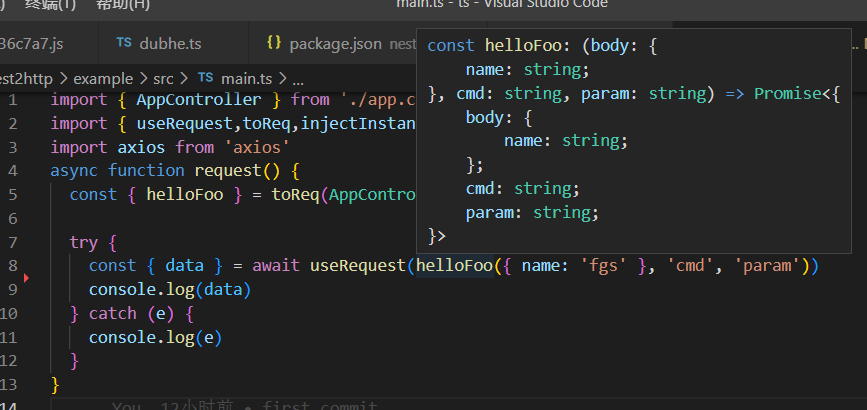
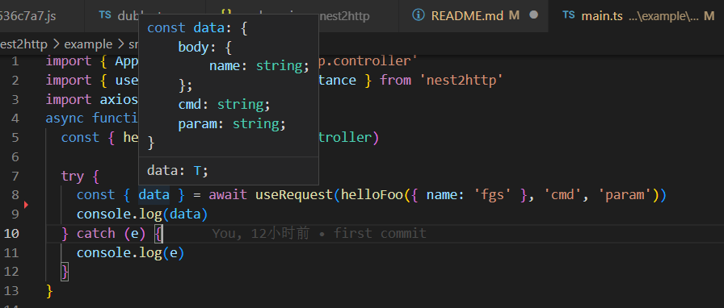

# nest2http

compile nestjs controller to http request with nice type support

> based on `nestjs`,`unplugin` and `axios`
> All parameters that are decorated by the nestjs decorator must come first

## backend

```ts
// in xx.controller.ts
@Controller("foo")
export class AppController {
  constructor() {}

  @Post(":id")
  async helloFoo(
    @Body() body: { name: string },
    @Query("command") cmd: string,
    @Param("id") param: string
  ) {
    return { body, cmd, param };
  }
}
```

## frontend
in vite.config.ts
```ts
import { defineConfig } from 'vite'
import { unplugin } from 'nest2http/node'
export default defineConfig(
    {
        plugins: [unplugin.vite()],
    }
)
```


```ts
import { useRequest,toReq,injectInstance } from 'nest2http'

// inject axios instance
injectInstance(
  axios.create({
    baseURL: "http://localhost:3002/",
  })
);
const { helloFoo } = toReq(AppController);// parse controller to http-request
const { data } = await useRequest(helloFoo({ name: "fgs" }, "cmd", "param"));
```


## type support

